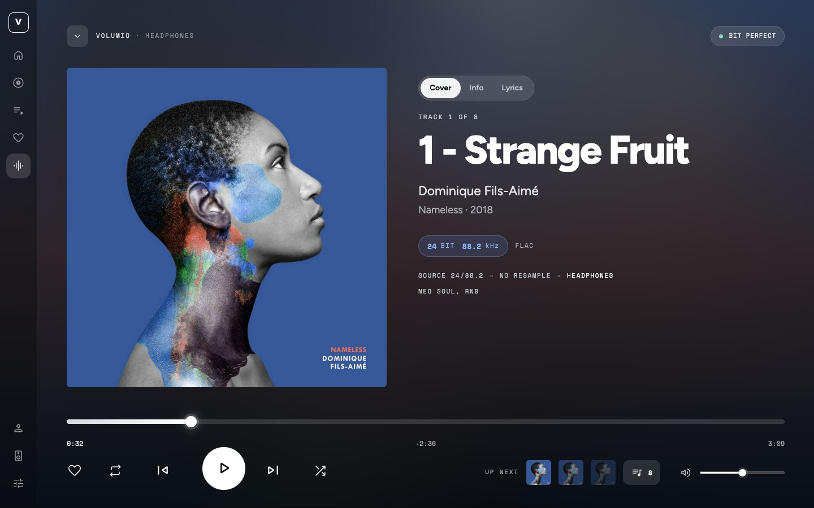
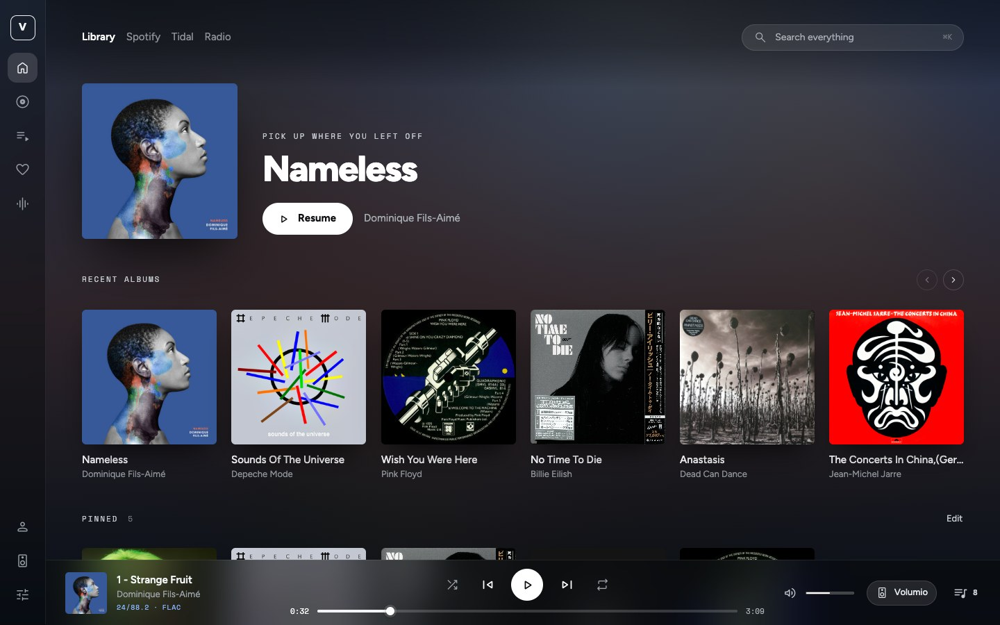
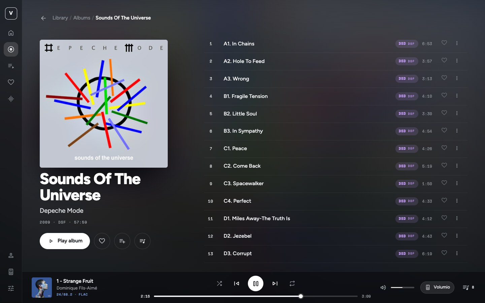
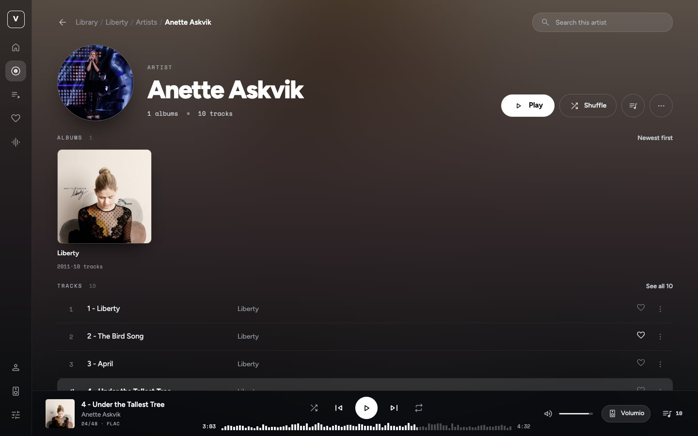
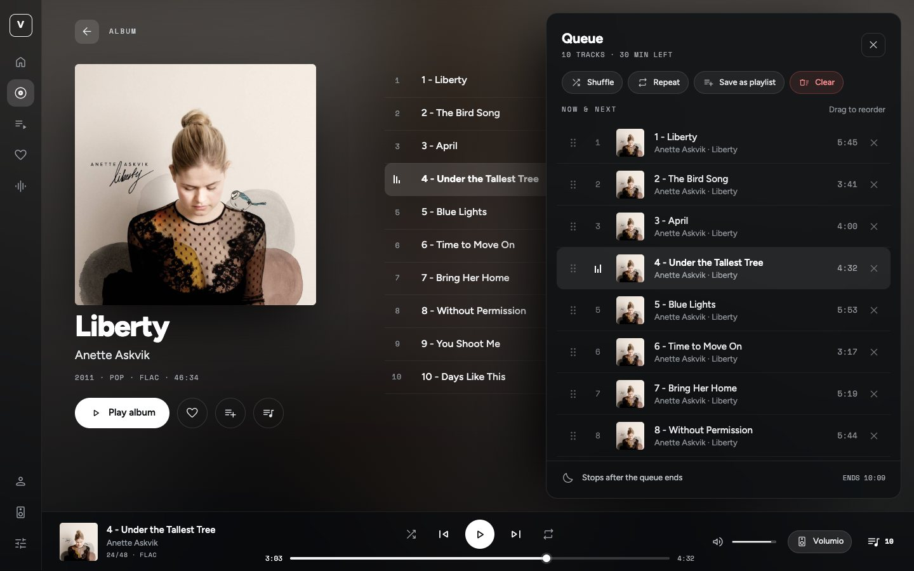
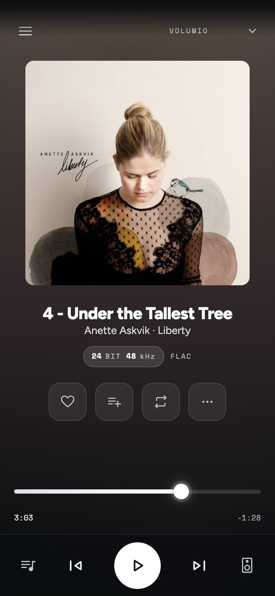
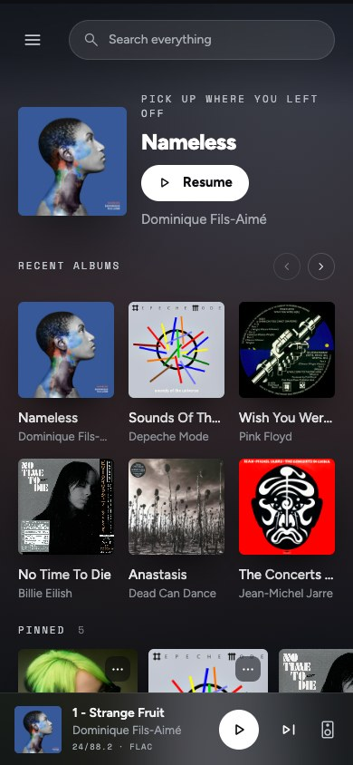

# Artwork One for Volumio

[](https://github.com/michaltamas/volumio-artwork-theme/actions/workflows/ci.yml)
[](https://github.com/michaltamas/volumio-artwork-theme/releases/latest)
[](LICENSE)

### Every record has a face. Artwork One gives it the whole screen.

Artwork One turns your [Volumio](https://volumio.com) player into something you want to look at. The cover of whatever is playing spills across the entire screen, softly blurred, and every control floats above it on frosted glass. The colours come straight from the artwork, so the interface changes its mood with every album: warm amber for one record, deep ocean blue for the next.

Beneath the new look sits everything you already rely on. Every source, every setting and every plugin Volumio offers is still there, with nothing hidden and nothing taken away. It lives on your player, installs with a single command, and feels at home wherever you meet your music: on the phone in your hand, a tablet on the sofa, a desktop browser, or a small touch screen next to your DAC.

- **Made for listening in high resolution.** Bit depth, sample rate, format and source, shown with pride instead of tucked away.
- **A waveform instead of a progress bar.** Glide through a track with a finger, a mouse or the arrow keys.
- **One fluid design.** No fixed breakpoints: it reshapes itself continuously for any screen, down to edge-to-edge on an iPhone.
- **Free to try.** One line to install, one click in Settings to switch back.



---

## Table of contents

- [Features](#features)
- [Screenshots](#screenshots)
- [Requirements](#requirements)
- [Installation](#installation)
- [Updating](#updating)
- [Switching back and uninstalling](#switching-back-and-uninstalling)
- [Building from source](#building-from-source)
- [How it works](#how-it-works)
- [Troubleshooting](#troubleshooting)
- [Known limitations](#known-limitations)
- [Contributing](#contributing)
- [Credits](#credits)
- [Disclaimer](#disclaimer)
- [License](#license)

---

## Features

**Now Playing**
- Large cover next to the title, artist and album, sized to fill the screen at any window size.
- The real format as Volumio reports it: bit depth, sample rate, file type and streaming service (for example *24 BIT 192 kHz · FLAC · QOBUZ*), and the path from the source to the output device.
- A waveform scrubber across the full width with a playhead and elapsed, remaining and total time. Drag it with the mouse or a finger, or use the arrow keys.
- *Up next* thumbnails that start the next tracks directly.
- Opens from the mini player with a slide-up and closes back to where you were.

**Mini player**
- Cover, title, artist and a compact quality line (*24/192 · FLAC*), transport, waveform, volume, the zone and output picker, and the queue button with the number of tracks.

**Queue**
- A floating panel instead of a separate page: drag to reorder, remove, shuffle, repeat, save as a playlist, clear, and the time the queue ends.

**Library and sources**
- Home with *Pick up where you left off* and recently played albums.
- Album pages with the cover beside the track list, artist pages with albums and tracks, breadcrumbs, grid and list views, sorting, filtering and an A–Z index.
- Every Volumio source works as before: the music library, Web Radio, Spotify, media servers and music service plugins.

**Everywhere**
- A fluid layout with no fixed breakpoints: it adapts continuously to phones, tablets, desktop browsers and unusual displays on media players.
- Phone layout with a menu sheet, swipe gestures and edge-to-edge display on iPhone, including the status bar colour.
- Settings, plugin pages, MyVolumio, dialogs and notifications restyled in the same visual language.
- Fonts and icons are served from the player, so the interface also works without internet access.

## Screenshots

| | |
|---|---|
|  |  |
| **Home** | **Album** |
|  |  |
| **Artist** | **Queue** |

<p align="center">
  
  &nbsp;&nbsp;
  
</p>

## Requirements

| | |
|---|---|
| Player | Volumio 4.x. Developed and tested on Volumio 4.119 on a Raspberry Pi (Debian bookworm). Volumio 3 uses the same interface mechanism but has not been tested. |
| Access | SSH access to the player, once, for the installation |
| Network | The player needs internet access while installing, to download the release from GitHub |
| Browser | A current version of Chrome, Edge, Firefox or Safari, including Safari on iPhone and iPad |

## Installation

Artwork One is installed next to Volumio's own interfaces. Nothing is replaced, and you can switch back at any time from the settings.

1. **Enable SSH** on the player: open `http://volumio.local/dev` (or `http://<player-ip>/dev`) in a browser and switch SSH on. See Volumio's [SSH guide](https://developers.volumio.com/Device/ssh) for details.
2. **Connect** from a terminal. The default password is `volumio`:
   ```bash
   ssh volumio@volumio.local
   ```
3. **Install** the latest release:
   ```bash
   curl -fsSL https://raw.githubusercontent.com/michaltamas/volumio-artwork-theme/master/scripts/install.sh | bash
   ```
4. **Select it** in the Volumio web interface: open **Settings → System**, choose **Artwork One** under *User Interface layout design* and press **Save**. The page reloads in the new interface.

To install and switch to it in one step, add `--activate`. Volumio restarts, then reload the page:

```bash
curl -fsSL https://raw.githubusercontent.com/michaltamas/volumio-artwork-theme/master/scripts/install.sh | bash -s -- --activate
```

To install a particular version, pass `--version`, for example `bash -s -- --version v1.0.0`.

**What the installer does.** It downloads `artwork-ui.tar.gz` from the [latest release](https://github.com/michaltamas/volumio-artwork-theme/releases/latest), unpacks it to `/data/artwork-ui` and registers it in `/data/thirdPartyUisList.json`, Volumio's list of additional interfaces. With `--activate` it also writes `/data/active_volumio_ui` and restarts Volumio. It changes nothing under `/volumio`. Because everything lives on the data partition, the installation survives Volumio system updates. You are welcome to read [the script](scripts/install.sh) before running it.

## Updating

Run the installation command again. It replaces the files in place, so the interface keeps working while it updates; reload the page afterwards. To see which version is installed:

```bash
cat /data/artwork-ui/VERSION
```

## Switching back and uninstalling

To go back to Volumio's own interface, choose it under *User Interface layout design* in **Settings → System**. Artwork One stays installed and can be selected again later.

To remove it completely, run on the player:

```bash
curl -fsSL https://raw.githubusercontent.com/michaltamas/volumio-artwork-theme/master/scripts/uninstall.sh | bash
```

If Artwork One is the active interface at that moment, the player switches back to its default interface and Volumio restarts.

## Building from source

The build runs in Docker, so the only thing you need on your machine is [Docker](https://docs.docker.com/get-docker/). Volumio's web interface is built with Gulp 3, node-sass and Bower, which require Node.js 10; the container provides it.

```bash
git clone https://github.com/michaltamas/volumio-artwork-theme.git
cd volumio-artwork-theme
./build.sh artwork artwork
```

The first build downloads all dependencies and takes several minutes; later builds take one to two minutes. The result is in `dist/`.

To try your build on a player, copy it there and install it with the same installer a release uses:

```bash
scripts/deploy.sh volumio@volumio.local              # install, select it in Settings yourself
scripts/deploy.sh volumio@volumio.local --activate   # install and switch to it
```

`deploy.sh` uses `ssh`, `scp` and `rsync`. Set up key-based login first (`ssh-copy-id volumio@volumio.local`), otherwise it asks for the password several times. The host can also come from the `VOLUMIO_HOST` environment variable.

To produce the release archive from `dist/`:

```bash
scripts/package.sh v1.0.0        # writes artwork-ui.tar.gz
```

Releases are built by [GitHub Actions](.github/workflows/ci.yml) from the tagged source and attached to the GitHub release automatically.

## How it works

Volumio's web interface is a single AngularJS application, [Volumio2-UI](https://github.com/volumio/Volumio2-UI), that ships with several themes: Classic, Contemporary and Manifest. This repository is a fork of it with one more theme, `artwork`. The player's backend serves whichever theme is selected in **Settings → System** and talks to it over the same Socket.IO API as always, so Artwork One needs no changes on the player besides its own files.

| Path | What lives there |
|---|---|
| `src/app/themes/artwork/` | The theme: templates, styles, fonts and icons |
| `src/app/themes/artwork/artwork-tokens.scss` | Design tokens: colours, radii, and the fluid type and spacing scales built on `clamp()` |
| `src/app/themes/artwork/zz-fluid/` | The layout switches for narrow, short and phone-sized screens, loaded last |
| `src/app/components/aw-*`, `src/app/services/aw-*` | Components only this theme uses: the queue panel, the phone menu and the settings shell |
| Other files under `src/app/` | Volumio's shared code, extended where the theme needed more (for example theme-specific templates with a fallback to Volumio's own) |
| `scripts/` | Installer, uninstaller, deployment and packaging |
| `build.sh` | The reproducible Docker build |
| `docs/volumio2-ui.md` | The upstream project's original README |

Volumio's other themes remain in the source tree. This project only builds and publishes Artwork One.

## Troubleshooting

| Symptom | What to do |
|---|---|
| *Artwork One* is missing from *User Interface layout design* in Settings → System | Check that `/data/thirdPartyUisList.json` lists it and that `/data/artwork-ui/index.html` exists. Running the installer again fixes both. |
| The page stays blank or looks half-styled after switching | Reload the page, bypassing the cache (Shift + reload), because the browser may still hold files from the previous interface. |
| The installer reports *download failed* | The player has no internet access, or GitHub is unreachable from it. Download `artwork-ui.tar.gz` from the releases page on another computer, copy it to the player and run `install.sh --from artwork-ui.tar.gz`. |
| You cannot reach the settings any more to switch back | Run the uninstaller over SSH, or write another interface to `/data/active_volumio_ui` and run `volumio vrestart`. |
| Anything else | Open an [issue](https://github.com/michaltamas/volumio-artwork-theme/issues) with your Volumio version, device, browser and a screenshot. |

## Known limitations

- The waveform is a generated pattern, not the actual audio peaks of the track, because Volumio does not provide peak data. It works as a normal seek bar.
- The *Bit perfect* badge and the *No resample* step of the signal path are fixed labels. Volumio does not report whether the output is resampled, so they are not measured.
- Only tested on Volumio 4.x.
- Artwork One is not part of Volumio's built-in interface list, so installing it needs SSH once.
- A few labels the theme introduces, such as *Up next*, are in English only for now. Everything that comes from Volumio uses Volumio's translations.
- Plugins that bring their own custom HTML pages keep their own look inside the theme.

## Contributing

Bug reports and pull requests are welcome. Please read [CONTRIBUTING.md](CONTRIBUTING.md) first: it covers the build and deployment loop, the layout rules the theme follows, and what a useful bug report contains.

## Credits

- The [Volumio](https://volumio.com) team and the contributors to [Volumio2-UI](https://github.com/volumio/Volumio2-UI), on whose interface this theme is built.
- Typefaces: [Figtree](https://github.com/erikdkennedy/figtree), [Space Mono](https://github.com/googlefonts/spacemono) and [Lato](https://www.latofonts.com), under the SIL Open Font License; icons: [Material Symbols](https://github.com/google/material-design-icons), under the Apache License 2.0. See [NOTICE.md](NOTICE.md).

## Disclaimer

This is an independent, unofficial project. It is not affiliated with, endorsed by, or supported by Volumio. Volumio is a trademark of its respective owner.

## License

The Artwork One theme and this project's changes to Volumio's interface are released under the [MIT License](LICENSE) © Michal Tamas. The code this project is forked from belongs to Volumio and its contributors and is not relicensed here, and the bundled fonts keep their own licenses. [NOTICE.md](NOTICE.md) explains exactly what the license covers.
